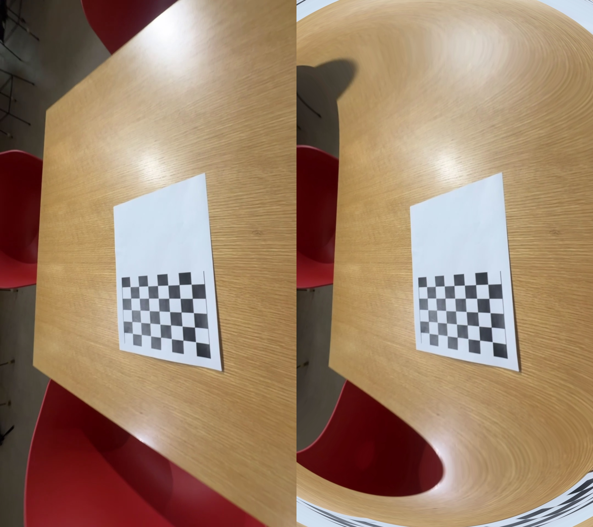
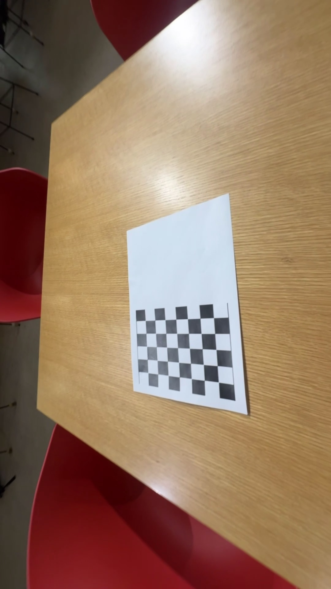
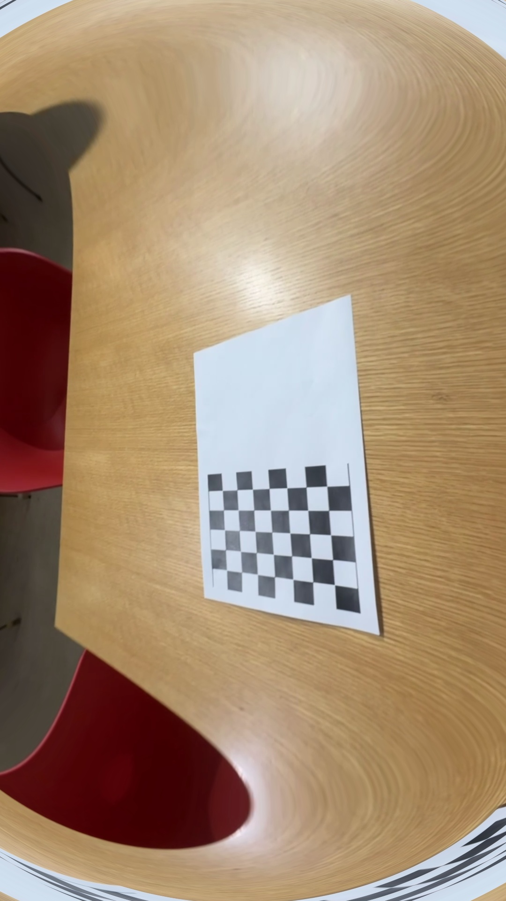

# Camera Lens Distortion Corrector

A Python tool that calibrates a camera from a chessboard video and corrects lens distortion using OpenCV.  
Designed for smartphone wide-angle lenses where barrel distortion is clearly visible.

---

## Features

- Extracts frames from a chessboard video and detects corner points automatically
- Computes camera intrinsic parameters and lens distortion coefficients
- Applies distortion correction to the full video
- Displays original and corrected video side by side in real time

---

## Requirements

```bash
pip install opencv-python numpy
```

---

## How to Use

**1. Camera Calibration**
```bash
python camera_calibration.py
```
- Input: `chessboard.mp4`
- Output: `outputs/calibration_result.npz`, `outputs/calibration_result.txt`

**2. Lens Distortion Correction**
```bash
python distortion_correction.py
```
- Input: `chessboard.mp4` + `outputs/calibration_result.npz`
- Output: `outputs/undistorted.mp4`, `outputs/comparison.mp4`
- Press `q` to quit the preview window

---

## Calibration Results

| Parameter | Value |
|---|---|
| Image Size | 1080 × 1920 |
| fx | 812.52 |
| fy | 811.35 |
| cx | 538.01 |
| cy | 939.45 |
| k1 | -0.02322 |
| k2 | 0.11695 |
| p1 | 0.00261 |
| p2 | -0.00332 |
| k3 | -0.26976 |
| **RMSE** | **0.0420 px** |

---

## Results

### Side-by-side Comparison


### Individual Frames

| Original | Undistorted |
|----------|-------------|
|  |  |

### Videos
- [Undistorted Video](outputs/undistorted.mp4)
- [Comparison Video](outputs/comparison.mp4)
