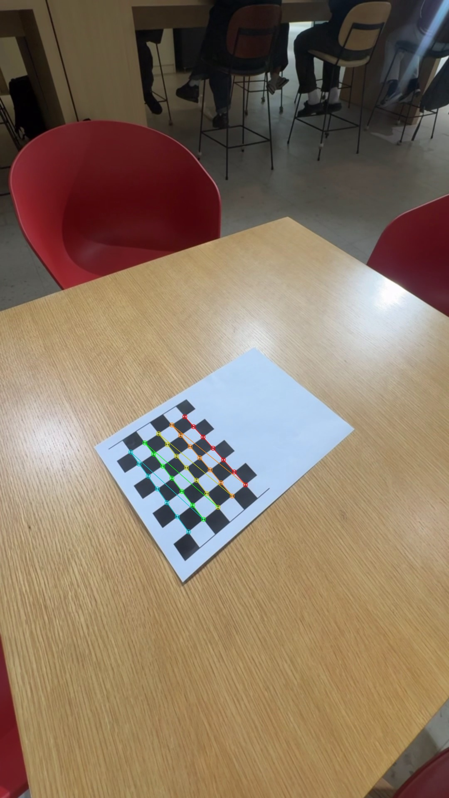

# Camera Calibration and Lens Distortion Correction

## Overview

This project performs camera calibration and lens distortion correction using OpenCV.
A chessboard pattern is used to estimate intrinsic camera parameters and distortion coefficients, and then apply undistortion to video frames.

---

## Features

* Chessboard corner detection from video frames
* Camera intrinsic parameter estimation
* Lens distortion estimation
* Reprojection error (RMSE) evaluation
* Lens distortion correction (video undistortion)
* Visualization of calibration and correction results

---

## Calibration Result

### Intrinsic Parameters

* fx = 812.52
* fy = 811.35
* cx = 538.00
* cy = 939.44

### Distortion Coefficients

* k1 = -0.0232
* k2 = 0.1169
* p1 = 0.0026
* p2 = -0.0033
* k3 = -0.2698

### RMSE

* 0.0420

---

## Method

### 1. Data Acquisition

A chessboard pattern was printed and captured using a camera from multiple viewpoints (different angles, distances, and positions).

### 2. Corner Detection

Chessboard corners were detected using OpenCV and refined to subpixel accuracy.

### 3. Camera Calibration

Intrinsic parameters and distortion coefficients were estimated using multiple frames.

### 4. Distortion Correction

The estimated parameters were applied to remove lens distortion from the video.

---

## Results

### Chessboard Corner Detection



### Distortion Correction (Video)

#### Undistorted Video

* outputs/undistorted.mp4

#### Comparison Video (Before vs After)

* outputs/comparison.mp4

---

## Files

* `camera_calibration.py` : camera calibration
* `distortion_correction.py` : lens distortion correction
* `outputs/` : result files (images, videos, parameters)

---

## Requirements

* Python 3.x
* OpenCV
* NumPy

Install dependencies:

```bash
pip install opencv-python numpy
```

---

## How to Run

### Camera Calibration

```bash
python camera_calibration.py
```

### Distortion Correction

```bash
python distortion_correction.py
```

---

## Notes

* A flat chessboard is required for accurate calibration.
* Multiple viewpoints improve calibration quality.
* Lower RMSE indicates more accurate calibration.
* Distortion correction improves geometric accuracy, especially near image boundaries.
